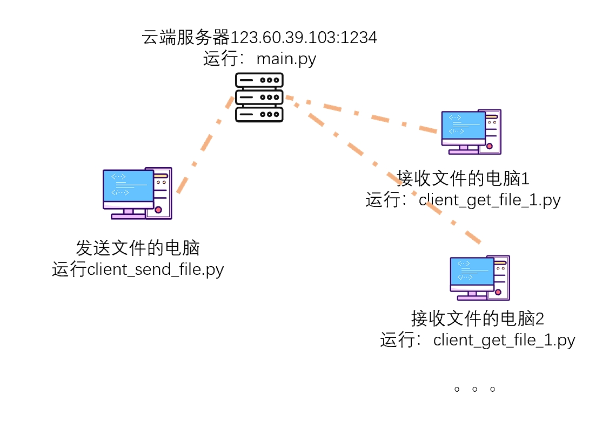

# 快速同步文件和消息
> 可以快速的同步文件到另外一个地方的电脑文件夹中

- 在websocket中使用json传递字符串消息，再服务器端和客户端会对json的格式进行解析
- 文件经过base64编码变成字符串
- 一个电脑发送文件后，其他电脑可以自动同步出现
- 注意修改代码中需要同步的文件夹名称
- 同步的文件大小需要小于10mb

- 运行图


- 结构图



## 消息定义
- 通用
- `task`表示任务名称
- `authentication`表示用于鉴权的字符串，当登录成功，会返回这个字段，把这个字段放入任务中，才会执行任务
- `data`表示任务附带的数据

```json
{
  "task": "",
  "authentication": "authentication",
  "data": ""
}
```

- 通用返回服务器消息
```json
{
  "task": "task_name",
  "status": "ok",
  "data": "data"
}
```

- 客户端保持连接
```json
{
  "task": "ping",
  "authentication": "",
  "data": ""
}
```

- 登录

```json
{
  "task": "login",
  "authentication": "",
  "data": {
    "username": "username",
    "password": "password"
  }
}
```

登录成功返回的消息,一般从服务器发送

```json
{
  "task": "login",
  "status": "ok",
  "data": {
    "username": "username",
    "authentication": "authentication"
  }
}
```

- 传递文件的任务

```json
{
  "task": "transmission_file",
  "authentication": "authentication",
  "data": {
    "file_name": "a.png",
    "file_base64_data": "file_base64_data"
  }
}
```
```json
{
  "task": "transmission_file",
  "status": "ok",
  "data": {
    "file_name": "a.png",
    "file_base64_data": "file_base64_data"
  }
}
```

- 传递明文消息

```json
{
  "task": "transmission_word",
  "authentication": "authentication",
  "data": "hello world"
}
```

- 将文件传递到服务器

```json
{
  "task": "upload_file",
  "authentication": "authentication",
  "data": {
    "file_name": "a.png",
    "file_base64_data": "file_base64_data"
  }
}
```

- 从服务器下载文件

```json
{
  "task": "download_file",
  "authentication": "authentication",
  "data": {
    "file_name": "file_name"
  }
}
```
```json
{
  "task": "download_file",
  "status": "ok",
  "data": {
    "file_name": "a.png",
    "file_base64_data": "file_base64_data"
  }
}
```


